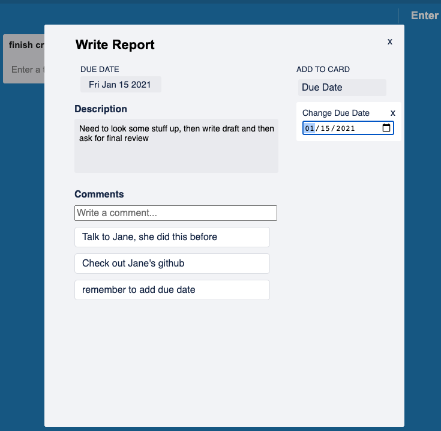

# SayHello


Sayhello is a clone of Trello, an organizational tool to keep track of tasks. This app allows you to create new boards, lists and cards to help organize your todo's and projects. In addition, you can share your boards with other users to view or collaborate. To further user experience, you can also add comments and due dates to cards.  

[Live Demo](https://sayhello-aa.herokuapp.com/#/)

## Technologies Used
Backend: Ruby on Rails, PosgreSQL
Frontend: Redux, React, CSS, HTML

## Features

* User Authentication 
* Board, List, Cards, Comments 
* Adding Due Dates on Cards
* Sharing Boards 

## Highlights 

### Dynamic Due Dates
To enhance user experience, users can choose to add a due date. If they choose not to, that will not appear on the card, but if they do, they can update the card with a due date. 


By utilizing state and checking to see if there is a due date, the due date will render accordingly. In addition, users can toggle the "Due Date" on the "Add to Card" to add a due date. 
```jsx
let dateTime;
if (this.state.deadline.length>0) {
    let dateArr = this.state.deadline.split("-")
    let month = dateArr[1];
    let date = dateArr[2].slice(0,2);
    let year = dateArr[0];
    dateTime = `${month} ${date}, ${year}`
}
let showDate = <div className="edit-card-duedate">
            <h3>DUE DATE</h3>
            <h3 className="duedate">{new Date(dateTime).toDateString()} </h3>        
        </div>

```

```jsx
<div className="card-edit-form-info">
    <section className="edit-card-descp">
        {dateTime ? showDate : null}
        <div className="edit-card-description"> Description </div>
        <textarea row="5"
            value={this.state.description}
            onChange={this.handleChange("description")} 
            onBlur={this.handleSubmit}/>
    </section>

    <section className="edit-card-deadline">
        <h2 className="deadline-title">ADD TO CARD</h2>
        <div className="edit-card-deadline"> 
            
            <h4 className="add-to-card-label" onClick={(e) => this.handleDueDateClick(e)}>Due Date</h4>
            <div style={{display:`${this.state.dueDateOpen}`}} className="card-deadline-form">
                <div><p className="change-dd">Change Due Date</p> 
                <h4 onClick={(e) => this.handleDueDateClick(e)}>x</h4></div>

                <input type="date" 
                onChange={this.handleChange("deadline")} 
                onBlur={this.handleSubmit}/>
            </div>
        </div>
    </section>
</div>
```