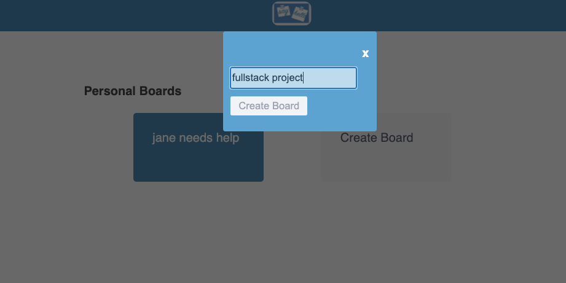
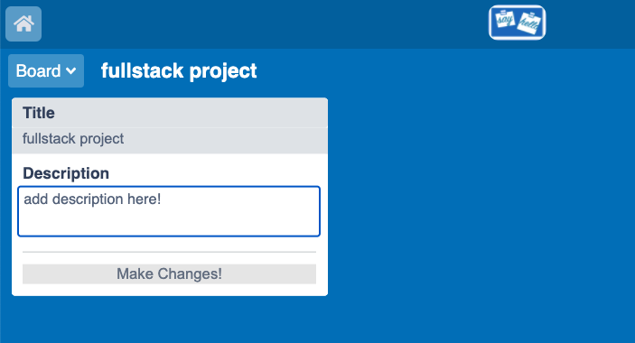

# SayHello

[Live Demo](https://sayhello-aa.herokuapp.com/#/)

SayHello is a clone of Trello, a todo board app that helps you organize and proritize your tasks so that you can efficently get work done with others. This clone is in progress and below are some of the current working features: 

## Features
### User Authentication and Demo
Users can create their own log in to access their boards, list, and cards. Alternatively, potential users can demo the site before creating an account. 

### Boards
Users can create and edit a board for their projects to keep track of progress of project

### Lists & Cards
Users can create and remove lists on their boards to organize the the tasks that needs to be done. 
Similarly, users can add task cards to the different lists, and remove them accordingly. 

## Technologies
Backend: Ruby on Rails, PostgreSQL
Frontend: React, Redux, CSS, HTML5
